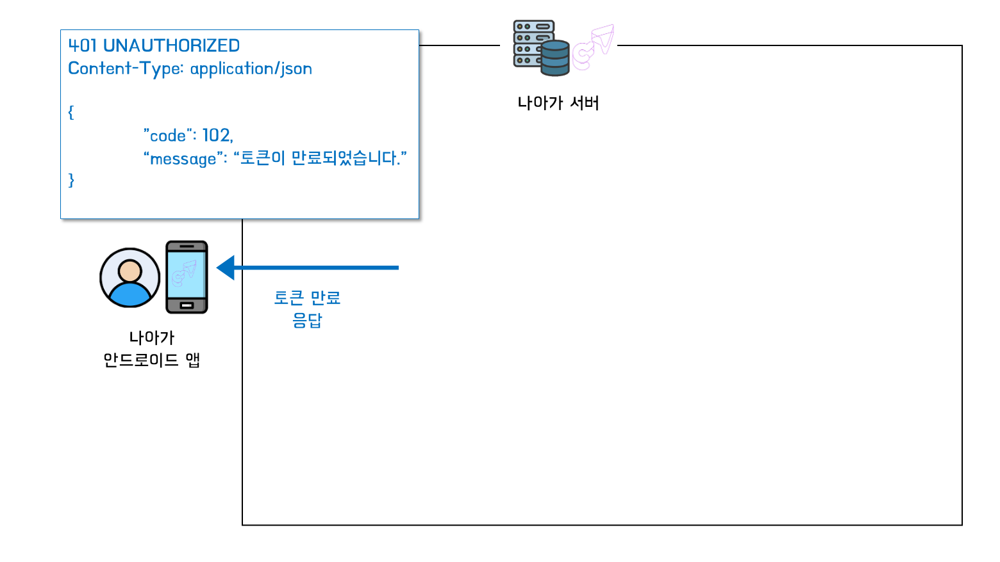

작성자: 루카[(github 링크)](https://github.com/dooboocookie)

## 🎯 글의 목적

- `나아가` 서비스에 로그인 기능 구현
    - 로그인 시 필요한 기술에 대한 학습 및 적용기에 대한 설명
    - 더불어 팀원들에게 지식 전달 측면에서 작성하는 글
- 나아가 서버에서 소셜 로그인을 적용에 대해서 `전체적인 흐름`을 설명한다.
- `Access Token과 Refresh Token` 적용 방식을 설명한다.

---

## ❓소셜 로그인을 사용하는 이유

- 나아가 서비스 특성상 회원가입, 로그인 과정이 단순해야하므로 소셜 로그인 기능 구현 필요
- 사용자의 선택사항을 최대한으로 줄이기 위해서, `일단 카카오 소셜 로그인만` 적용할 예정

---

## 🔑 Oauth2.0 개념

- OAuth 2.0은 인증을 위한 표준 프로토콜이다.
- 다른 플랫폼(구글, 카카오, 깃헙, ...)의 `리소스` 접근 권한을 위임 받는 것이다.

### 용어

#### Resouce Server (자원 서버) & Authorization Server (권한 부여 서버)

- 사용하고자 하는 자원을 보관하거나 접근 권하는 주는 서버를 의미한다.
    - 구글, 카카오, 깃헙, ...
- Resource Server
    - 자원을 가지고 있는 서버
- Authorization Server
    - 자원에 접근할 권한(토큰)을 부여해주는 서버
- RFC6749([링크](https://datatracker.ietf.org/doc/html/rfc6749#section-1.2)) 에 의하면 이 둘은 따로 보지만, 같이 두는 경우도 있음.

#### Resouce Owner (자원의 소유자)

- 사용하고자 `자원의 소유자`를 의미한다.
    - 나아가로 예시를 들면,
        - 나아가 앱을 사용하는 사용자
        - 카카오에 회원정보(리소스)를 보관중인 사람

#### Client (자원을 사용)

- `자원을 사용`하고자 하는 주체를 의미한다
    - 나아가로 예시를 들면,
        - 나아가
        - 나아가에서는 기본적인 회원 정보를 사용한다.

### Oauth2.0의 흐름


(출처: https://blog.naver.com/mds_datasecurity/222182943542)

#### 0. 클라이언트 등록


- Client가 Resource Server의 자원을 이용하기 위해 등록하는 과정이다.
    - Resource Server에서 Client임을 식별하기 위한 정보가 필요하다.
1.  Redirect URI
- 로그인 인증 성공 시, 리다이렉트 시킬 위치를 지정하는 URI
- OAuth 과정에서 정보들(Authorization Code)을 다른 URI로 탈취당하지 않기 위함
- https만 허용
2. Client ID, Secret
- Resource Server가 Client임을 식별하기 위한 장치
- Client Secret은 유출되지 않도록 조심

#### 1. 로그인 요청 (로그인 페이지 보여주기)


- `OOO으로 로그인`하기 버튼을 누르거나 `로그인이 필요한 기능에 접근했을 때 리다이렉트로` 발생되는 요청이다.
- `유저(리소스 오너)`가 `나아가(클라이언트)`에게 로그인 요청을 했을 때`카카오(리소스 서버)`로 로그인 요청을 보낸다.
- 로그인 요청을 할 땐 아래 항목을 포함해서 보낸다.
    - client_id: 어떤 클라이언트(나아가)임을 나타내는 정보
    - scope: 리소스 오너(유저)가 동의한 리소스 항목
    - redirect_uri: 인가 코드를 전달 받을 클라이언트(나아가)의 URI
    - response_type: 응답을 어떤 타입으로 받을지 설정, 인가 코드로 응답을 받을 것이므로 code로 고정
    - ...

#### 2. 로그인 정보 제공하고 Authorization Code 발급 받기


- 리소스 오너(유저)는 리소스 서버(카카오)의 `로그인 페이지`를 제공 받고, 로그인 정보를 입력하거나 로그인된 정보를 제공한다.
- Authorzation Code를 응답 받는다.
- Redirect URI로 리다이렉트 된다.

#### 3. Authorization Code ↔️ OAuth Access Token 교환


- Redirect된 나아가 서버에서 Authorization Code를 가지고, 권한 부여 서버로 Access Token을 발급 요청한다.
- 권한 부여 서버가 Authorizaion Code에 대한 리소스 오너의 리소스로 접근 가능한 OAuth Access Token을 발급한다.

#### 4. 로그인 처리


- 이제 클라이언트가 리소스 오너의 리소스를 리소스 서버로 부터 받아올 수 있는 OAuth Access Token이 있으므로 로그인 처리를 하면 된다.
- 세션을 사용하던, JWT를 사용하던 사용자(리소스 오너)에게 로그인이 되었다는 응답을 준다.

#### 5. Access Token 으로 정보 조회


- 필요 시 리소스 서버로부터 리소스 오너의 리소스가 필요하다면 3번에서 발급받은 Access Token을 사용하면된다.

---

## 🪙 Token 방식 (JWT)

### JWT 개념
- JSON Web Token
- JSON 형식으로 쉽게 읽히고 해석되기 위한 토큰
- 필요한 정보에 대해서 자체적으로 가지고 있다.
    - 회원에 대한 정보, 유효기간,  ...
    - 서버에 유저 상태를 필수적으로 저장할 필요는 없다.
    - 서버 확장에 용이하다.

### JWT 구조


- JWT는 `헤더`, `페이로드`, `서명`으로 구성되어 있고, `점(.)`으로 구분한다.

#### 1. 헤더

- 토큰 타입이나 알고리즘에 대한 정보를 포함한다.
- Base64Url로 인코딩된다.

```
{
  "alg": "HS512",
  "typ": "JWT"
}
```

#### 2. 페이로드

- Claims이라고 불리는 토큰 자체 데이터를 포함한다.
    - Registered claims: 유효기간(exp), 토큰의 대상(sub), 발행처(iss), 발행 시간(iat), ...
    - Public claims: IANA JWT Registry에 등록해서 다른 조직과 충돌을 피하고자 하는 공용 claims을 등록한다.
    - Prviate claims: 사용자의 권한 정보 같이 어플리케이션 내에서만 사용되는 클레임을 나타낸다.
- Base64Url로 인코딩한다.

```
{
  "sub": "{\"memberId\":1,\"authId\":1,\"authType\":\"KAKAO\"}",
  "exp": 4845877047
}
```

#### 3. 시그니처

- 토큰의 무결성을 보장하는 정보를 포함한다.
- 아래의 정보를 헤더에서 명시된 알고리즘으로 생성한다.
    - 인코딩된 헤더.인코딩된 페이로드
    - 시크릿 키

```
HMACSHA512(
  base64UrlEncode(header) + "." + base64UrlEncode(payload),
  시크릿 키
)
```

### Access Token

- 사용자의 권한을 나타내는 토큰
- 토큰 자체로 토큰의 담겨있는 유저의 정보에 접근이 가능하다.
- 탈취 위험성 때문에 토큰의 수명이 짧다.
- stateless한 HTTP 통신에서 인증처리를 한 사용자임을 나타내기 위해 `Authorization` 헤더에 포함되어 요청이 간다.

### Refresh Token
- Access Token이 매우 짧은 수명을 갖고 있으므로, 그 시기마다 로그인 요청을 하지 않고 Refresh Token을 통해서 `Access Token을 재발급` 받기 위함이다.
- Access Token에 비해 수명이 매우 길다.

---

## 📄 나아가 적용

### 로그인 과정

- OAuth와 JWT를 기반으로 로그인 기능을 구현한다.
- 일단 나아가 같은 경우, 안드로이드 앱을 기반으로 한다.
- 안드로이드 단에서는 Kakao SDK for Android([링크](https://developers.kakao.com/docs/latest/ko/kakaologin/android))를 기반으로 하여 로그인 기능을 구현하였다.
    - 위 OAuth 흐름에서 설명했던 내용 중, 인가 코드를 카카오 액세스 토큰으로 교환하는 것 까지 안드로이드에서 일어난다.

#### 1. 카카오에서 Kakao Access Token을 받아온다.


- 카카오에게 유저가 로그인 정보를 제공하고 Kakao AccessToken을 제공 받는다.

#### 2. 나아가 서버로 로그인 요청


- 나아가의 로그인 처리를 위해서 카카오에서 받급받은 Kakao Access Token을 가지고 로그인 요청을 한다.

```http
POST /auth
Content-Type: application/json

{
		"token": "q1q2w2w3e3e4r4t5t6yu7u78",
		"type": "KAKAO",
}
```

#### 3. 카카오 서버로 부터 정보를 받아온다.


1. AuthClient 객체의 카카오와 통신하는 메서드 호출
    - AuthClient: RestTemplate으로 외부 서버와 통신하는 객체
2. 클라이언트로 부터 받은 Kakao Access Token으로 카카오 리소스 서버에게 유저 정보를 요청한다.
    - API 문서 ➡️ [링크](https://developers.kakao.com/docs/latest/ko/kakaologin/rest-api#req-user-info)
3. 2번 요청 시, 파라미터로 넘긴 정보 값들에 대해서 해당 사용자가 scope를 동의했으면, 유저 정보를 넘겨준다. (API 문서 참고)
4. AuthInfo 객체를 생성해서 반환한다.
    - 카카오에서 전달 받은 유저의 정보를 바인딩하기 위한 DTO이다.

#### 4. 회원을 조회하거나 저장하거나


- AuthInfo 담겨 있는 email 정보를 토대로 해당 회원이 있는지 파악한다.
    - 있으면, 해당 회원을 find 해온다.
    - 없으면, 새로운 회원을 create 한다.

#### 5. JWT 토큰 생성


- jjwt(JWT 라이브러리)를 이용하여 JWT 토큰을 생성한다.
- Token의 유효성을 검사하기 위해 나아가만의 Secret key 정보도 JWT 시그니처에 포함시킨다.
- 토큰의 Claims 정보는 다음과 같다.
    - 회원의 아이디
    - Oauth 인증처
    - Oauth 서버에서 사용하는 회원 아이디
    - 수명

```
{
  "sub": "{\"memberId\":1,\"authId\":1,\"authType\":\"KAKAO\"}",
  "exp": 4845877047
}
```

- 수명
    - Access Token은 30분
    - Refresh Token은 14일
- Access Token과 Refresh Token를 한 쌍으로 하는 AuthToken 엔티티 객체를 생성하여 반환한다.

#### 6. JWT 토큰 저장


- 토큰은 5번에서 보여지듯 토큰 자체가 정보를 갖고 있고, 수명까지 가지고 있다.
    - 그래서 서버는 유저의 로그인 정보인 토큰을 필수적으로 저장할 필요는 없다.
    - 유저가 헤더에 담아오는 토큰 정보를 보고 어떤 회원인지 판단하면 된다.
- 하지만, Refresh Token 관리를 위해서 서버에 저장하기로 결정했다.

|id|access_token|refresh_token|member_id|
|:---:|:---:|:---:|:---:|
|1|4r324r3.13r344v.32r443|4r324r3.13r34f4.32r443|3|
|2|4r324r3.3r234b4.32r443|4r324r3.3r234tg.32r443|4|
|...|...|...|...|

#### 7. 응답


- 이제 유저(안드로이드 앱)에게 Access Token과 Refresh Token이 전달되게 된다.
    - 안드로이드 로컬 스토리지에 저장해 뒀다가, 인증 정보가 필요한 요청에는 Authorization 헤더에 해당 정보를 포함해서 보내면 된다.


- 전체적인 흐름

### 인가 과정

#### 1. Interceptor와 Argument Resolver
- AuthInterceptor의 역할
    - 인가 처리를 위해서 인증이 된 사용자인지를 확인하는 과정을 거친다.
    - 인가가 필요한 요청URL을 매핑한다.

```java
    @Override
    public void addInterceptors(final InterceptorRegistry registry) {
        registry.addInterceptor(authInterceptor)
                .addPathPatterns("/**")
                .excludePathPatterns("/h2-console/**")
                .excludePathPatterns("/auth/**")
                .excludePathPatterns("/**/*.png", "/**/*.jpg", "/**/*.jpeg", "/**/*.gif", "/**/*.ico")
                .excludePathPatterns("/ranks");
    }
```

- PlayerArgumentResolver의 역할
    - 컨트롤러의 파라미터로 들어오는 PlayerRequest(플레이어 아이디)를 바인딩하기 위해 생각한다.

```java
    @Override
    public boolean supportsParameter(final MethodParameter parameter) {
        return parameter.hasParameterAnnotation(Auth.class)
                && parameter.getParameterType().equals(PlayerRequest.class);
    }
```

#### 2. AuthInterceptor에서 토큰 검증


- Authorization 헤더에 포함된 토큰 정보를 디코딩하며, 유효성을 검사한다.
    - 수명이 아직 유효한지 확인한다.
    - 시그니처의 시크릿 키가 일치하는지 확인한다.
- 유효한 토큰이라고 확인이 되면, 인증된 회원이라고 인식하고 통과한다.

#### 3. PlayerArgumentResolver에서 파라미터 바인딩


- Authorization 헤더에 포함된 토큰 정보를 디코딩하여, subject를 가져온다.


- subject에 포함된 memberId를 통해, PlayerService에서 Player를 가져온다.

#### 4. Controller 도달


- 인가 처리와 파라미터 바인딩을 마치고 컨트롤러에 도달한다.

### 토큰 갱신 (Refresh Token ➡️ Access Token 재발급)

#### 0. Access Token 만료



- Access Token로 인가처리를 하다가 만료된 Access Token이면 `토큰이 만료되었다`는 예외를 응답한다.

#### 1. Access Token 재발급 요청


- Access Token이 만료되었다는 응답을 받으면 Refresh Token을 가지고 토큰 재발급 요청을 한다.

#### 2. 저장되어 있는 Refresh Token 인지 확인


- 나아가의 DB에 저장되어 있는 Refresh Token인지 확인한다.
- 토큰의 유효성(수명, 시크릿 키)와는 상관 없이, DB에 저장되어 있는 Refresh Token만 사용가능한 토큰이라고 판단한다.

#### 3. Refresh Token을 삭제


- 재발급 요청에 쓴 Refresh Token은 더이상 사용할 수 없는 토큰이므로 `무조건 삭제`한다.
    - `올바른 사용자`, Refresh Token을 사용하여 새로운 Access Token과 Refresh Token을 발급할 것이므로 이전 토큰은 삭제한다.
    - `올바르지 않은 사용자`, 탈취당하거나 이미 만료된 Refresh Token이라면 이 토큰은 더 이상 사용되면 안되는 토큰이므로 삭제한다.

#### 4. 토큰 재발급


- Refresh Token에 대한 고민점
    - Refresh Token으로 재발급 요청을 했을 때 무조건 Access Token을 재발급 해주면, Refresh Token이 기간이 긴 Access Token이라는 생각이 들었다.
    - Refresh Token도 탈취 가능성이 있는데 어떤 검증을 해야할까?
    - 현실적으로 어떤 검증을 할 수 있을지 고민했는데, 간단하게 `Access Token이 만료되지 않았는데 재발급 요청한 상황`은 해당 Refresh Token은 탈취되었다고 판단했다.
- Access Token이 만료되었고, Refresh Token이 만료되지 않았다면 새로운 토큰 한 쌍을 발급하고 새로 저장한다.


#### 5. 응답


- 새로운 Access Token과 Refresh Token을 안드로이드로 응답한다.

### 회원 탈퇴 & 로그아웃

- 회원 탈퇴와 로그아웃 또한 API가 존재한다.

#### 회원 탈퇴

1. AuthToken(Refresh Token, Access Token) 삭제
    - 이미 어딘가에 발급된 Refresh Token을 사용하지 못하게 하기 위함
2. 회원 삭제
3. 카카오에게 해당 회원 연결 끊기 요청 발송
    - API 문서 ([링크](https://developers.kakao.com/docs/latest/ko/kakaologin/rest-api#unlink))
#### 로그아웃

1. AuthToken(Refresh Token, Access Token) 삭제
    - 이미 어딘가에 발급된 Refresh Token을 사용하지 못하게 하기 위함
2. 카카오에게 해당 회원 로그아웃 요청 발송
    - API 문서 ([링크](https://developers.kakao.com/docs/latest/ko/kakaologin/rest-api#logout))

#### 고려사항

- 연결 끊기, 로그아웃 요청에서 Kakao Access Token 필요
    - 현재 Kakao Access Token을 서버에서 보관하지 않는다.
    - 그래서 JWT Access Token 내에 있는 Kakao id로 해당 요청들을 보내서 해당 회원이 연결을 끊고 로그아웃 했다고 알린다.

---

## 👍 마치며

- OAuth 2.0과 JWT 토큰을 이용하여 로그인을 구현하였다.
- 아직 고려할 점이 많다.
    - 카카오 뿐 아니라 다른 소셜 로그인이 붙는다면 AuthClient, AuthInfo 추상화
    - 더 안전한 Refresh Token을 통한 토큰 재발급 프로세스
    - 카카오의 Access Token을 현재는 서버에 저장하지 않지만, 카카오의 리소스가 로그인 접속 시, 지속적으로 필요하면 저장할 필요가 있음
- 개념적인 부분과 나아가 서버의 적용된 내용의 프로세스에 대해서 대략적으로 설명한다.
    - 혹시 코드가 궁금하다면 여기([링크]())를 클릭해주세요.
